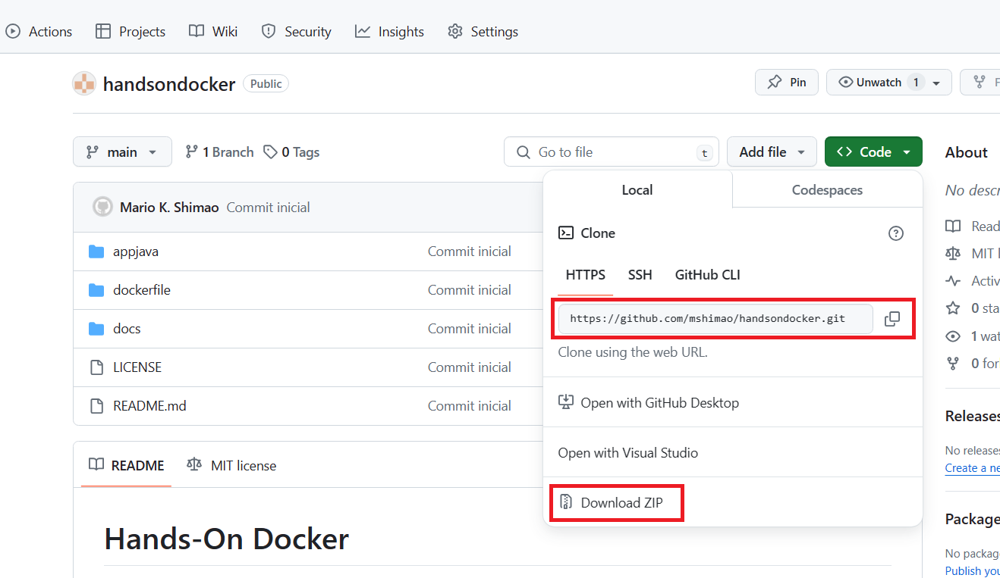

# Hands-On Docker

Hands-On para introdução dos conceitos do Docker.

### Requisitos

Inicialmente é necessário configurar os requisitos para trabalharmos com o Docker.

Os requisitos são:
- Docker Desktop for Windows
- [VS Code](https://code.visualstudio.com/download) - Editor de código open source.
- [Docker extension](https://marketplace.visualstudio.com/items?itemName=ms-azuretools.vscode-docker) - Extensão do Docker para o VS Code, auxilia na edição dos arquivos de configuração.
- [MySQL extension](https://marketplace.visualstudio.com/items?itemName=formulahendry.vscode-mysql) - Extensão do MySQL para o VS Code, permite gerenciar e realizar querys no MySQL.

### Instalação do Docker Desktop for Windows

O primeiro passo é ler a documentação do Docker que explica os requisitos para a instalação do Docker Desktop for Windows:

- [Requisitos para o Docker Desktop for Windows](https://docs.docker.com/desktop/install/windows-install/#system-requirements)

Após a leitura e configuração dos requisitos, agora é fazer o download do Docker Desktop for Windows e a instalação.

- [Instalar o Docker Desktop for Windows](https://docs.docker.com/desktop/install/windows-install/#install-docker-desktop-on-windows)

Com isso temos o ambiente preparado para executar os contêineres Docker.

### Criar uma conta no Docker Hub

Acesse o site do Docker Hub e crie uma conta.

- [Docker Hub](https://hub.docker.com/)

### Copiar os arquivos do hands-on

Para prosseguir será necessário copiar os arquivos do hands-on, para isso, realizar o clone do repositório git ou o download do zip.

Agora todos os requisitos para a realização do hands estão prontos.

Próximo: [Atividade 01](docs/01-atividade.md)