# Atividade 06

## Acessando os containeres 

Nesta atividade vamos acessar o prompt do container e acessar os dados do MySQL a partir do VS Code.

#### Passo 1

Vamos habilitar a conexão de fora do container do usuário root do MySQL, para isso vamos acessar o prompt do container do MySQL.

Executar o comando `docker ps` para listar os containeres que estão sendo executados. Copie o nome do container do MySQL.

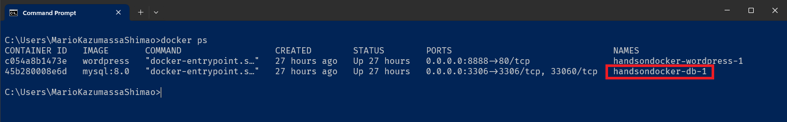

#### Passo 2

Para acessar o bash do container do MySQL vamos usar o comando `docker exec -it handsondocker-db-1 /bin/bash`, sendo que handsondocker-db-1 é o nome do container.

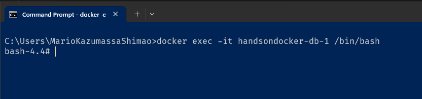

#### Passo 3

Agora vamos logar no MySQL, usando o comando `mysql -u root -p`. Informar a senha "Agl@1234".

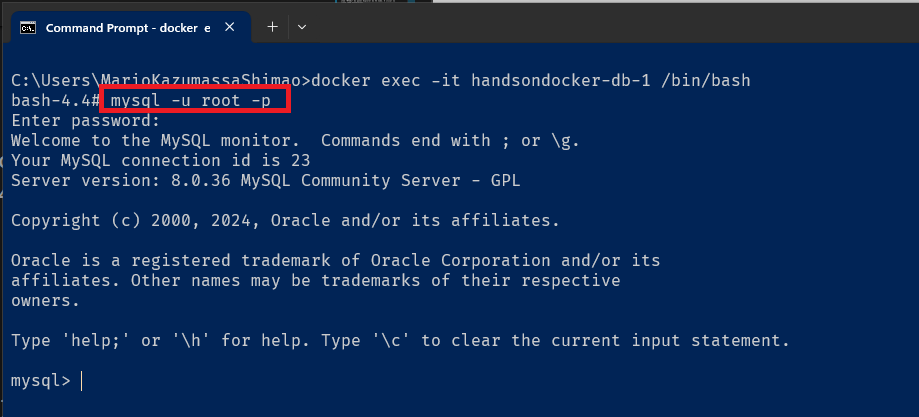

#### Passo 4

Vamos habilitar o usuário para login externo, usando o comando `ALTER USER 'root' IDENTIFIED WITH mysql_native_password BY 'Agl@1234';`.

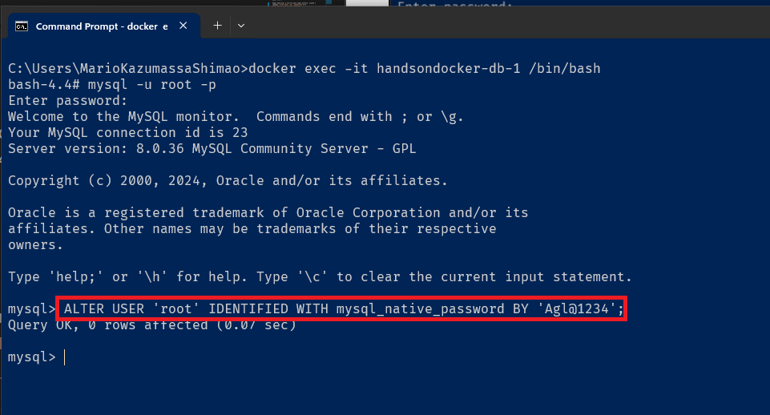

#### Passo 5

Vamos acessar o MySQL com o VS Code, para isso clicar no item "MYSQL" do panel Explorer do VS Code. E clicar no ícone "Add Connection".

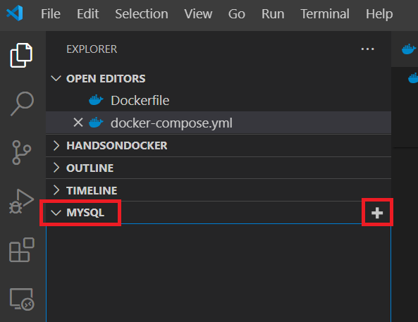

Preencher o hostname com "localhost" e dar um enter.

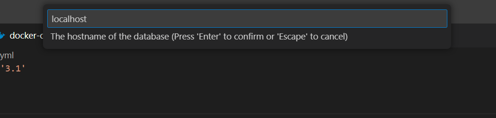

Preencher o usuário com "root" e dar um enter.

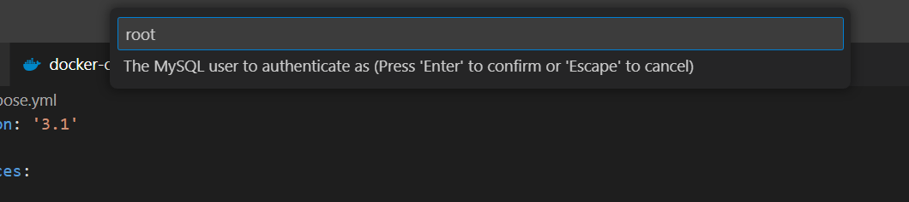

Preencher a senha com "Agl@1234" e dar um enter.

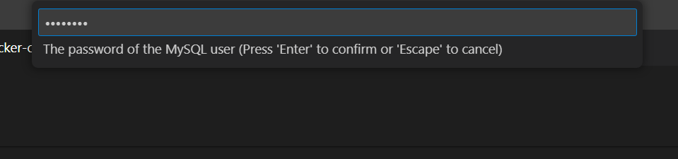

Manter o valor 3306 no campo porta e dar um enter.

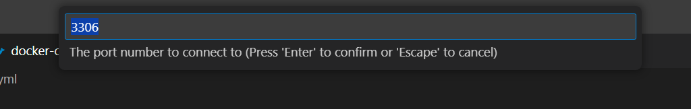

Manter o campo do certificado em branco e dar um enter

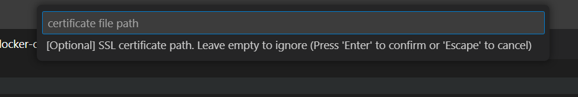

A conexão com o MySql vai aparecer no painel do VS Code.

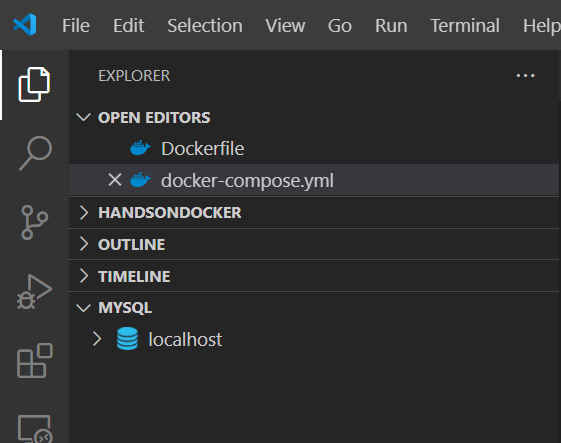

#### Passo 6

Vamos fazer uma query na tabela wp_posts da base de dados exampledb. Para isso, clicar no ícone ">" e abrir a lista de tabelas da base de dados exampledb.

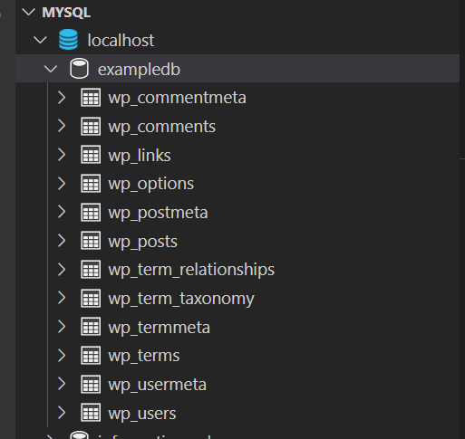

Clicar com o botão direito do mouse sobre a tabela wp_posts e clicar na opção "Select Top 1000".

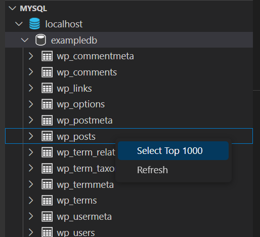

Será executado a query e apresentado o resultado no VS Code.

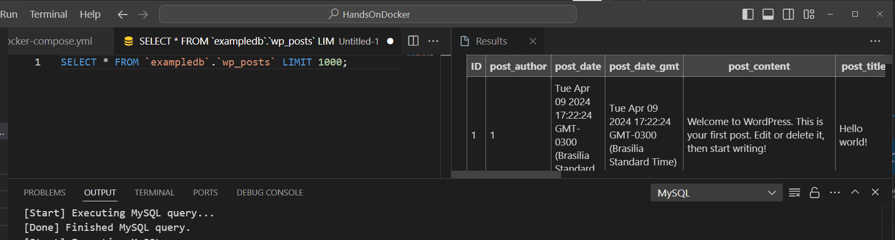

Próximo: [Atividade 07](07-atividade.md)
