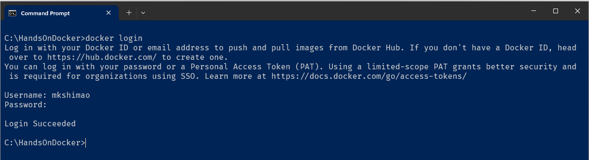
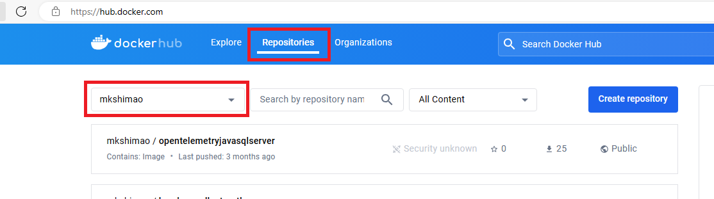
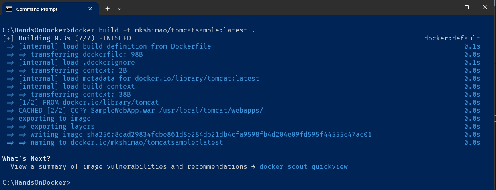
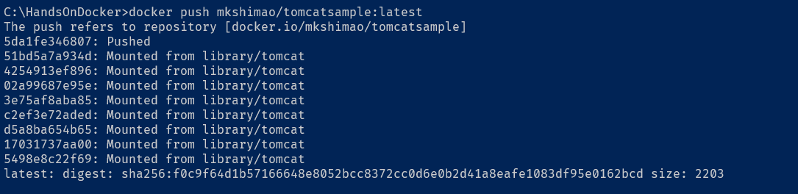
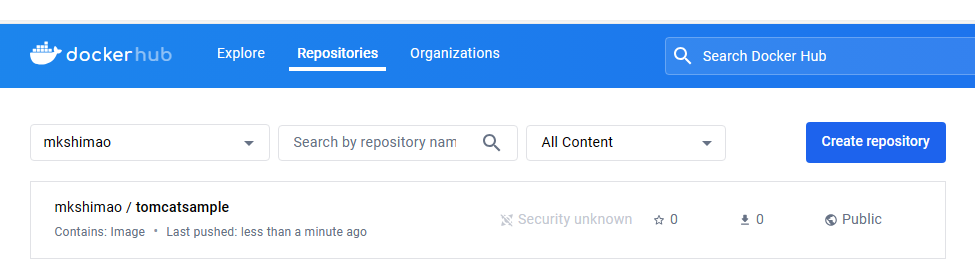

# Atividade 7

## Docker Hub

O Docker Hub é um repositório público de imagens de containers, onde diversas empresas e pessoas podem publicar imagens pré-compiladas de soluções. Essas soluções incluem desde WordPress, MySql e outras aplicações diversas.
Nele, você encontra imagens prontas para uso, criadas por desenvolvedores da comunidade, projetos open-source e fornecedores de software independentes (ISVs).

### Publicando uma imagem no Docker Hub

#### Passo 1

Abra um prompt de linha de comando e digite o comando `docker login`. Informe o usuário e senha que foi criado anteriormente.

#### Passo 2

Acesse o site do Docker Hub e faça login.

- [Docker Hub](https://hub.docker.com/)

#### Passo 3

Na aba "Repositories", pegue o nome da conta, no exemplo da imagem é "mkshimao".

#### Passo 4

Vamos criar uma nova imagem usando o Dockerfile já existente. O nome da nova imagem será a combinação do nome do usuário do repositório do Docker Hub e tomcatsample, também iremos adicionar uma tag na imagem.
Vá até a pasta c:\handsondocker onde está o arquivo Dockerfile e digite o comando `docker build -t mkshimao/tomcatsample:latest .` para gerar uma nova imagem.

#### Passo 5

Na linha de comando, executar o comando `docker images` para conferir se a imagem foi criada.

Notar que a imagem foi gerada com a TAG latest, poderia ter ser o número da versão, como no caso do mysql que tem a tag "8.0".

#### Passo 6

Agora vamos publicar a imagem no Docker Hub.
Para isso, na linha de comando, executar o comando `docker push docker_id/nome_do_repositorio:TAG` para publicar a imagem, substituindo docker_id pelo nome da conta, nome_do_repositorio pelo nome da imagem e TAG por latest. No exemplo do handson o comando ficaria assim: `docker push mkshimao/tomcatsample:latest`.

#### Passo 7

Acesse o site do Docker Hub, na aba repositories, verifique se a imagem aparece na lista.

Lembrando que essa imagem foi publicada na área pública e que está disponível para qualquer um acessar. Para projetos de clientes o ideal é publicar as imagens na área privada ou publicar num serviço de repositório privado, como do Azure.

## Documentação do Docker Hub

Para maiores detalhes sobre o Docker Hub, consultar a documentação abaixo:

- [Documentação do Docker Hub](https://docs.docker.com/docker-hub/)

